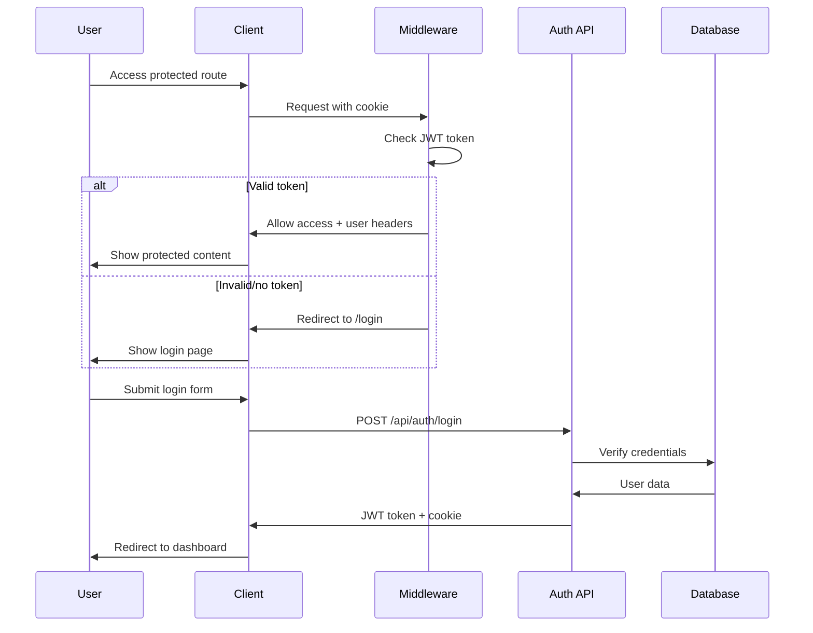

# 🔐 Sistem Authentication Sahabat Istimewa

## 📋 Overview

Sistem authentication yang aman dan robust untuk aplikasi Sahabat Istimewa dengan fitur:

- **JWT-based Authentication** dengan library `jose`
- **Middleware Protection** untuk semua route yang memerlukan auth
- **Role-based Access Control** (ADMIN, PARENT, THERAPIST, PSYCHOLOGIST)
- **Secure Cookie Storage** untuk SSR compatibility
- **Client-side Auth Hook** untuk state management

## 🏗️ Arsitektur

### 1. Middleware (`middleware.ts`)
- Melindungi semua route yang memerlukan authentication
- Validasi token JWT di server-side
- Redirect otomatis ke login jika tidak authenticated
- Menambahkan user info ke headers untuk API routes

### 2. Authentication Library (`src/lib/auth.ts`)
- Utility functions untuk JWT operations
- Server-side authentication helpers
- Client-side token management

### 3. Auth Hook (`src/hooks/use-auth.ts`)
- State management untuk authentication
- Login/logout functions
- Role-based access control
- Auto-redirect functionality

### 4. Protected Route Component (`src/components/auth/protected-route.tsx`)
- Client-side route protection
- Loading states
- Role-based access control
- Error handling

## 🔧 Implementasi

### Setup Environment Variables

```env
JWT_SECRET=your-super-secret-jwt-key-here
DATABASE_URL=your-database-url
```

### Protected Routes

Semua route berikut memerlukan authentication:
- `/admin` - Hanya ADMIN
- `/parent` - Hanya PARENT
- `/therapist` - Hanya THERAPIST  
- `/psychologist` - Hanya PSYCHOLOGIST

### API Endpoints

#### Authentication
- `POST /api/auth/login` - Login user
- `POST /api/auth/logout` - Logout user
- `GET /api/auth/me` - Get current user info

#### Protected APIs
- `GET /api/users` - Hanya ADMIN
- `POST /api/users` - Hanya ADMIN
- `DELETE /api/users` - Hanya ADMIN

## 🚀 Cara Penggunaan

### 1. Login Page

```tsx
import { useAuth } from '@/hooks/use-auth'

export default function LoginPage() {
  const { login, loading, error } = useAuth()
  
  const handleLogin = async (email: string, password: string) => {
    await login(email, password)
  }
  
  return (
    // Your login form
  )
}
```

### 2. Protected Pages

```tsx
import { ProtectedRoute } from '@/components/auth/protected-route'

export default function AdminPage() {
  return (
    <ProtectedRoute allowedRoles={['ADMIN']}>
      <div>Admin Dashboard</div>
    </ProtectedRoute>
  )
}
```

### 3. API Routes

```tsx
import { requireRole } from '@/lib/auth'

export async function GET(request: NextRequest) {
  try {
    // Require specific role
    await requireRole(request, ['ADMIN'])
    
    // Your API logic here
  } catch (error) {
    if (error.message === 'Unauthorized') {
      return NextResponse.json({ error: 'Unauthorized' }, { status: 401 })
    }
    if (error.message === 'Forbidden') {
      return NextResponse.json({ error: 'Forbidden' }, { status: 403 })
    }
  }
}
```

### 4. Client-side Auth Check

```tsx
import { useAuth } from '@/hooks/use-auth'

export default function MyComponent() {
  const { user, hasRole, logout } = useAuth()
  
  if (hasRole(['ADMIN'])) {
    return <AdminOnlyContent />
  }
  
  return <RegularContent />
}
```

## 🔒 Security Features

### 1. JWT Security
- Menggunakan library `jose` yang lebih aman dari `jsonwebtoken`
- Token expiration (24 jam)
- Secure signing dengan environment variable

### 2. Cookie Security
- `httpOnly: true` - Mencegah XSS attacks
- `secure: true` - Hanya HTTPS di production
- `sameSite: 'strict'` - Mencegah CSRF attacks
- `maxAge: 24h` - Auto-expire

### 3. Middleware Protection
- Server-side validation untuk semua protected routes
- Automatic redirect ke login
- Token validation di setiap request

### 4. Role-based Access Control
- Server-side role validation
- Client-side role checking
- Granular permissions per endpoint

## 🧪 Testing

### Demo Credentials

```bash
# Admin
Email: admin@sahabatistimewa.com
Password: admin123

# Parent  
Email: sari.parent@email.com
Password: admin123

# Therapist
Email: dr.budi@sahabatistimewa.com
Password: admin123

# Psychologist
Email: dr.ani@sahabatistimewa.com
Password: admin123
```

### Test Scenarios

1. **Unauthenticated Access**
   - Coba akses `/admin` tanpa login
   - Harus redirect ke `/login`

2. **Wrong Role Access**
   - Login sebagai PARENT
   - Coba akses `/admin`
   - Harus tampil "Access Denied"

3. **API Protection**
   - Coba akses `/api/users` tanpa token
   - Harus return 401 Unauthorized

4. **Token Expiration**
   - Login dan tunggu 24 jam
   - Token harus expired dan redirect ke login

## 🔄 Flow Authentication



## 🛠️ Troubleshooting

### Common Issues

1. **"Unauthorized" Error**
   - Check JWT_SECRET environment variable
   - Verify token expiration
   - Check cookie settings

2. **Infinite Redirect Loop**
   - Clear browser cookies
   - Check middleware configuration
   - Verify route protection setup

3. **Role Access Issues**
   - Verify user role in database
   - Check role validation logic
   - Ensure proper role strings

### Debug Commands

```bash
# Check JWT token
npm run dev
# Open browser dev tools
# Check Application > Cookies > auth-token

# Test API directly
curl -X GET http://localhost:3000/api/auth/me \
  -H "Cookie: auth-token=your-token-here"
```

## 📚 Dependencies

```json
{
  "jose": "^5.2.0",
  "bcryptjs": "^2.4.3"
}
```

## 🔄 Migration dari Sistem Lama

Jika Anda memiliki sistem authentication lama:

1. **Backup data user** dari database
2. **Update login flow** untuk menggunakan hook baru
3. **Wrap protected pages** dengan `ProtectedRoute`
4. **Update API calls** untuk include credentials
5. **Test semua scenarios** authentication

## 🚀 Deployment

### Production Checklist

- [ ] Set `JWT_SECRET` environment variable
- [ ] Enable HTTPS (required for secure cookies)
- [ ] Set `NODE_ENV=production`
- [ ] Test authentication flow
- [ ] Verify role-based access
- [ ] Check security headers

### Environment Variables

```env
# Required
JWT_SECRET=your-super-secret-key-here
DATABASE_URL=your-database-url

# Optional
NODE_ENV=production
```

---

**⚠️ Penting**: Jangan pernah commit JWT_SECRET ke repository. Gunakan environment variables untuk semua sensitive data.
